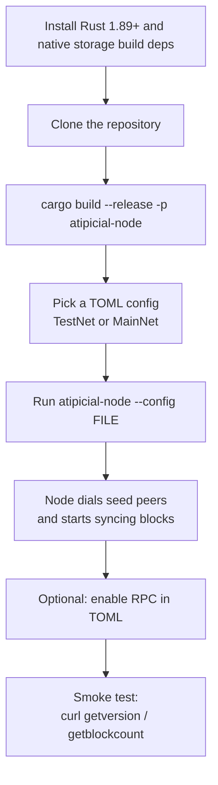

<!-- Atipicial Chain · sovereign Layer-1 for smart contracts and digital assets -->
<!-- 👑 Founded & engineered by xmoohad — Blockchain Scientist · Computer Programmer -->

# Getting Started

This guide walks you through building `atipicial-rs`, running a Atipicial N3 node on
TestNet or MainNet, pointing it at a data directory, and verifying it over
JSON-RPC. `atipicial-rs` is a from-scratch Rust implementation of the Atipicial N3 node
targeting byte-for-byte compatibility with the C# reference node through Atipicial
v3.10.1. Differential execution, sustained live-peer operation, complete
MainNet replay/state parity, and authenticated checkpoint fast sync remain
production release gates.

The runnable program is a single daemon, `atipicial-node`. It syncs the chain over a
custom TCP P2P protocol and optionally serves a JSON-RPC API. There is no
separate CLI client binary — you query a running node over HTTP.

## Quickstart flow



## Prerequisites

| Requirement | Version / Notes |
|-------------|-----------------|
| Rust toolchain | 1.89 or newer (the workspace uses edition 2024 and standard-library file locking). Install via [rustup](https://rustup.rs). |
| Native storage build dependencies | MDBX is built from its bundled C source and its bindings are generated with bindgen. On Ubuntu/Debian: `build-essential clang libclang-dev`. |
| Disk | A full MainNet persistent store grows large (hundreds of GB over time). Use a durable volume. |
| OS | Linux or macOS. |

You do not need a system MDBX library. The build compiles bundled MDBX source;
`libclang` is required to generate the FFI bindings.

## Clone and build

```bash
git clone https://github.com/r3e-network/atipicial-rs.git
cd atipicial-rs

# Build the runnable node daemon (release profile)
cargo build --release -p atipicial-node
```

This builds the full node with MDBX persistence and the RPC server. The only
optional feature is `tee` (Trusted Execution Environment
support), enabled with `--features tee`.

The resulting binary is at `target/release/atipicial-node`.

## Configuration files

The node reads a single TOML config file. The repository ships ready-to-use
presets under `config/`:

| File | Network | Notes |
|------|---------|-------|
| `config/testnet.toml` | TestNet | Sets `network_type = "testnet"`, TestNet seeds, P2P `20333`, RPC `20332`. |
| `config/testnet-service.toml` | TestNet | Service-provider preset: RPC, AtipicialIndexer, ApplicationLogs, TokensTracker, StateService, metrics, and JSON file logs. |
| `config/mainnet.toml` | MainNet | MainNet magic, MainNet seeds, P2P `10333`, RPC `10332`. |
| `config/mainnet-service.toml` | MainNet | Service-provider preset for AtipicialFura-style workloads behind a reverse proxy. |
| `config/mainnet-stateroot.toml` | MainNet | MainNet variant with the state-root service enabled. |

The `--config` flag defaults to `atipicial_testnet_node.toml` (in the current working
directory) when not given. A missing config file is not fatal — the node falls
back to its built-in MainNet protocol preset and logs a warning. Always pass
`--config` explicitly so the node joins the network you intend.

See [configuration.md](./configuration.md) for the full key reference.

## Run a TestNet node

```bash
# Persistent data is written to the path in [storage] (config/testnet.toml uses ./data/testnet)
./target/release/atipicial-node --config config/testnet.toml
```

On startup the node:

1. Loads protocol settings from the TOML (or the matching built-in preset).
2. Opens MDBX persistence, or the in-memory provider for an explicitly ephemeral node.
3. Starts the blockchain service and begins persisting blocks.
4. Starts the P2P listener and dials the configured seed nodes.
5. Starts the JSON-RPC server if `[rpc] enabled = true`.

Stop the node with `Ctrl-C`; it shuts down gracefully.

## Run a MainNet node

```bash
./target/release/atipicial-node --config config/mainnet.toml
```

`config/mainnet.toml` binds RPC to `127.0.0.1:10332` and listens for P2P on
`10333`. Expect a long initial sync from genesis.

## Run a service endpoint

Use the `*-service.toml` presets when you want one daemon to provide a
AtipicialFura-style endpoint with durable RPC indexes, token history, ApplicationLogs,
state proofs, `/metrics`, `/healthz`, and `/readyz`:

```bash
./target/release/atipicial-node --config config/testnet-service.toml
# or
./target/release/atipicial-node --config config/mainnet-service.toml
```

These presets bind RPC and telemetry to `127.0.0.1`; expose them through your
reverse proxy or tunnel rather than binding the daemon directly to the public
internet.

## Point at a data directory

The persistent store directory comes from `[storage] data_dir` (or its alias
`path`) in the TOML. You can override it on the command line without changing
the configured backend:

```bash
./target/release/atipicial-node --config config/mainnet.toml --storage-path /opt/atipicial/data
```

Notes:

- If `[storage] backend` is omitted, the node defaults to an in-memory store
  unless a persistent path is supplied. Set `backend = "mdbx"` and a directory,
  or pass `--storage-path`, for a production persistent node.
- A persistent backend with no directory configured (and no `--storage-path`) is an
  error.
- Data directories are tagged with the network magic; only start a node against
  a directory that matches its configured network.

## Preflight checks (no startup)

You can validate a config or storage path without starting the node:

```bash
# Validate the TOML config only
./target/release/atipicial-node --config config/mainnet.toml --check-config

# Validate that the storage backend can be opened
./target/release/atipicial-node --config config/mainnet.toml --check-storage

# Both at once
./target/release/atipicial-node --config config/mainnet.toml --check-all
```

## First JSON-RPC smoke check

Enable the RPC server in your config (`[rpc] enabled = true`), then query it over
HTTP. The default RPC ports are `20332` (TestNet) and `10332` (MainNet) in the
shipped configs.

```bash
# Node version, network magic, and hardfork schedule
curl -s -X POST http://127.0.0.1:10332 \
  -H 'Content-Type: application/json' \
  -d '{"jsonrpc":"2.0","id":1,"method":"getversion","params":[]}'

# Current block height (block count)
curl -s -X POST http://127.0.0.1:10332 \
  -H 'Content-Type: application/json' \
  -d '{"jsonrpc":"2.0","id":1,"method":"getblockcount","params":[]}'
```

A healthy node returns a JSON-RPC `result`. `getblockcount` should increase as
the node syncs. Replace `10332` with `20332` for TestNet.

## Command reference

| Command | Purpose |
|---------|---------|
| `cargo build --release -p atipicial-node` | Build the node daemon (release). |
| `cargo build --workspace` | Build every crate (tests, benches, optional integrations). |
| `./target/release/atipicial-node --config <FILE>` | Run the node with a TOML config. |
| `--config / -c <FILE>` | Path to the TOML config (default `atipicial_testnet_node.toml`). |
| `--storage-path <DIR>` | Override the persistent data directory for the configured/default backend. |
| `--network-magic <U32>` | Assert the selected built-in chain's network magic; a mismatch is rejected. |
| `--check-config` | Validate config and exit. |
| `--check-storage` | Validate storage access and exit. |
| `--check-all` | Run both preflight checks and exit. |
| `atipicial-node --help` | Full flag list. |

### Makefile shortcuts

The `Makefile` wraps common workflows (build, lint, test, preflight, Docker
Compose). Useful targets:

| Target | Action |
|--------|--------|
| `make build-release` | Release build of the workspace. |
| `make run-testnet` / `make run-mainnet` | Run `atipicial-node` with the standard TestNet or MainNet preset. |
| `make run-service-testnet` / `make run-service-mainnet` | Run `atipicial-node` with the service-provider presets. |
| `make preflight` | Run preflight checks for the bundled MainNet and TestNet configs. |
| `make test` | `cargo test --workspace`. |
| `make fmt` / `make clippy` | Format / lint. |
| `make compose-up` / `make compose-down` | Start / stop the Docker Compose stack. |
| `make compose-service` | Start Docker Compose with `ATC_PROFILE=service`. |

## Run with Docker

A multi-stage Docker build and a Compose file are provided. The container
selects a bundled config from `ATC_NETWORK`; set `ATC_PROFILE=service` to use
`config/testnet-service.toml` or `config/mainnet-service.toml` inside the image.
Direct Docker and Compose builds compile the workspace `atipicial-vm` crate, the same
sole VM implementation used by native and MainNet replay builds; no sibling VM
checkout or additional build context is required.

```bash
docker build -t atipicial-rs .

docker run -d --name atipicial-node \
  -p 20332:20332 -p 20333:20333 -p 19091:9091 \
  -v "$(pwd)/data:/data" \
  -e ATC_NETWORK=testnet \
  -e ATC_PROFILE=service \
  atipicial-rs
```

Key environment knobs:

| Variable | Meaning |
|----------|---------|
| `ATC_NETWORK` | `testnet` (default) or `mainnet`; picks the bundled config. |
| `ATC_PROFILE` | Empty/`node` for the standard bundled config, or `service` for the RPC/indexer service-provider preset. |
| `ATC_STORAGE` | Persistent storage path inside the container. |
| `ATC_CONFIG` | Path to a custom config if you bind-mount your own TOML. |
| `ATC_RPC_BIND_ADDRESS` | Runtime RPC bind address used for bundled service profiles; defaults to `0.0.0.0` in the container. |
| `ATC_METRICS_BIND_ADDRESS` | Runtime telemetry bind address used for bundled service profiles; defaults to `ATC_RPC_BIND_ADDRESS`. |
| `ATC_MAINNET_METRICS_PORT` / `ATC_TESTNET_METRICS_PORT` | Host ports used by Compose for container telemetry ports `9090` / `9091`. |
| `ATC_LOGS_DIR` | Log directory created by the entrypoint; defaults to `/data/Logs`. |
| `BETTER_STACK_SOURCE_TOKEN` | Optional Better Stack log bearer token referenced by `token_env`. |
| `GOOGLE_ERROR_REPORTING_TOKEN` | Optional Google Error Reporting bearer token referenced by `token_env`. |
| `SENTRY_AUTH_HEADER` | Optional full Sentry auth header value referenced by `headers_env`. |
| `RUST_LOG` | Temporary log filter override (e.g. `info`, `debug`). |

For bundled service profiles, the entrypoint writes a temporary config copy that
rebinds RPC and telemetry from the file's loopback defaults to container-facing
addresses. It also maps bundled service data paths from `./data/<network>/...`
to `ATC_STORAGE/...` and bundled log files to `ATC_LOGS_DIR/...`, so indexer,
ApplicationLogs, TokensTracker, StateService, and log output land on the
container volumes you configured. Explicit `ATC_CONFIG` files are used as-is.

The container health check calls `getversion` on the detected RPC port. For a
Compose-based setup, see `docker-compose.yml` and the `make compose-*` targets.

## Logging

The daemon logs via `tracing`. Default filters and formatting come from the
TOML `[logging]` section; set `RUST_LOG=info` or `RUST_LOG=debug` to override
the TOML level temporarily while diagnosing.

## Next steps

- [configuration.md](./configuration.md) — full TOML configuration reference.
- [operations.md](./operations.md) — production deployment, Docker, backups, monitoring, upgrades, and securing the RPC endpoint before exposing it.
- [rpc-api.md](./rpc-api.md) — the JSON-RPC method reference.
- [architecture.md](./architecture.md) and [dataflow.md](./dataflow.md) — how the node is built and how data flows through it.

---

> **Atipicial Chain** — sovereign Layer-1 for smart contracts and digital assets.
> 👑 Founded & engineered by **xmoohad** — Blockchain Scientist · Computer Programmer.
> `ATC` Atipicial Coin · `ATD` AtipicialDollar · addresses begin with **A**
